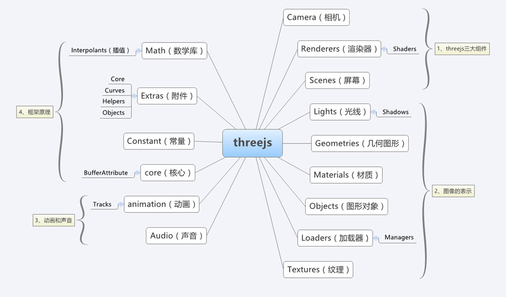

class: middle, center

# WebGL

陈一帅

实务学堂

.footnote[Web前端]

---
# 3D图形

- 我们在三维上体验世界
  - 越来越多屏幕媒体以3D呈现
- 渲染3D的软件现在无处不在：Web浏览器
  - 3D图形自1960年代开始出现，但需要具有特殊软件的高级计算机
  - 如今，计算机和移动设备都集成了3D处理硬件

---
# 渲染

- 将三维坐标以某种方式转为二维坐标
  - 将3D 图像在屏幕上以 2D 图像呈现
  - 将三维图形渲染在二维屏幕上
- 我们在CSS动画部分已经体验过3D
  - Z轴
  - 视角

---
# WebGL

- Web的标准3D图形API
- Mozilla工程师Vladimir Vukićević于2006年发起
- 底层绘图API
- 使用JavaScript，在浏览器中，利用计算机3D渲染硬件
  - 高性能
- 大部分浏览器均支持WebGL

---
# WebGL

- WebGL（Web Graphics Library）
  - 在 GPU 中运行
  - 类 C/C++ 的强类型语言 GLSL（OpenGL Shading Language)
- 编程需要提供成对方法
  - 顶点着色器
  - 片段着色器
- 每一对方法组合起来称为一个 program（着色程序）

---
# WebGL

- 顶点着色器
  - 计算顶点位置
- 片段着色器
  - 根据计算出的顶点位置，对点、线和三角形进行光栅化处理
  - 计算当前绘制图元中每个像素的颜色值
- 原生编程挺复杂
- Three.js 提供了高级编程接口

---
# 坐标系统 （Coordinate）

- 3D图形以笛卡尔坐标系表示
  - 除了“x”和“y”轴外，“z”值描述了深度
  - THREE.AxisHelper() 方法可将坐标系可视化
- “y”从窗口底部开始，向顶部增加
  - 和 2D Canvas（和CSS）坐标不同（HTML是y-down）

.center[.width-40[]]

---
# 网格（Mesh）

- 绘制3D图形最常见方法是mesh
  - 通常称为“models（模型）”
  - 好比一个包装工，将『可视化的材质』粘合在一个『数学世界里的几何体』上，形成一个『可添加到场景的对象』
- 由多边形组成3D形状
  - 最常用的多边形是三角形和矩形

.center[.width-60[]]

---
# 材质（Material）

- 材质描述多边形的表面属性
  - 纯色，有光泽的反射表面
  - 可以使用位图图像，创建纹理（textures）

---
# 光源（Light）

- 定义表面的亮度
- 感知深度等3D属性
  - 类似素描
- 一个场景中可以有一个或多个光源

---
# 相机（Camera）

- 3D场景需要一个观察视角
- 相机定义了相对于场景，观看者所处的位置
- 相机有一个属性叫”视野“，定义了视野的角度
  - 人是180度，鸟是360度
- 最终的3D图像被渲染到2D“viewport”中
  - 显示在屏幕上

---
# 着色器（Shader）

- 计算机图形硬件只理解顶点和纹理
- 3D场景的各个方面（材质，灯光，相机）需要转换为像素点，显示到屏幕上
  - “着色器shader”做这个工作
  - 计算网格物体的像素，显示到屏幕上
- 功能非常强大
  - JavaScript库可以完成这一部分

---
# Three.js

- WebGL JavaScript 库
  - 提供对WebGL API的高级访问，方便编程
  - 由Ricardo Cabello于2010年发布，也被称为“ Mr.doob”
- 使用方法
  - 下载 https://threejs.org/build/three.js ，或直接在HTML中链接它

[Three JS网站](https://threejs.org)

---
# 模块

.center[.width-110[]]

[Three.js现学现卖](https://aotu.io/notes/2017/08/28/getting-started-with-threejs/index.html)

---
# 核心对象和渲染流程

.center[.width-100[]]

---
# 创建一个场景

```js
var scene = new THREE.Scene();
```

[ThreeJS教程：创建场景](https://threejs.org/docs/index.html#manual/zh/introduction/Creating-a-scene)

---
# 透视相机

- fov 属性指定了横向视场
  - 基于长宽比（aspect）属性，纵向视场也就相应确定了
  - 近面和远面指定了可视域前后界，两者间元素才被渲染

.center[.width-80[]]

---
# 透视相机设置

- PerspectiveCamera
- 四个参数
  - 视场（FOV）：显示的场景范围，角度单位
  - 长宽比（aspect ratio）
  - 近截面（near）和远截面（far）：比远截面远或者近截面近的物体部分不会被渲染到场景中。可以获得更好的渲染性能

```js
var camera = new THREE.PerspectiveCamera(
  75,
  window.innerWidth / window.innerHeight,
  0.1,
  1000 );
```


---
# 透视相机参数

- fov：摄像机能看到的横向角度
  - 人类有接近 180 度视场，有些鸟类有接近 360 度视场
- 推荐默认值为：50
  - 由于计算机不能完全显示我们能够所看到的景象，所以一般会选择一块较小的区域
  - 游戏视场大小通常为 60 ~ 90 度

---
# 透视相机参数

- aspect 长宽比
  - 指定摄像机视野的横向尺寸和纵向尺寸的比值
  - 如果使用窗口作为输出界面，就使用窗口的长宽比。
  - 推荐默认值：window.innerWidth / window.innerHeight
- near
  - 摄像机摄像的最近距离，推荐默认值：0.1
- far
  - 摄像机从它所处的位置开始能看到多远
  - 过小，场景中的远处不会被渲染；过大，渲染内容太多，影响性能
  - 推荐默认值：1000

---
# 数值的单位

- 投影和其它变换在本质上都是无单位的
- 相对的
- 唯一的要求是使用统一的测量单位，然后按比例绘制最终图像

---
# 渲染器

- 施展魔法的地方
  - 按照摄像机位置，物体位置，进行计算，得到屏幕上显示的效果
- WebGL渲染器
  - 硬件加速

```js
var renderer = new THREE.WebGLRenderer();
renderer.setSize( window.innerWidth,
    window.innerHeight );
```

---
# 添加网页DOM元素

- 将renderer（渲染器）的dom元素（renderer.domElement）添加到HTML中
  - renderer.domElement就是显示场景给我们看的canvas元素

```js
document.body.appendChild( renderer.domElement );
```

---
# 立方体

- 创建一个BoxGeometry（立方体）对象
- 这个对象包含了一个立方体中所有的顶点（vertices）和面（faces）

```js
var geometry = new THREE.BoxGeometry();
```

---
# 材质

- 创建材质
  - 让立方体有颜色等
- 设定材质属性
  - color属性，值为0x00ff00，绿色
  - MeshBasicMaterial 材质不受光源影响

```js
var material  = new THREE.MeshBasicMaterial(
      { color: 0x00ff00 } );
```

---
# 网格

- 创建Mesh（网格）
  - 把几何体 geometry 和作用在它上面的材质 material 组合在一起
  - 好比一个包装工，将『可视化的材质』粘合在一个『数学世界里的几何体』上，形成一个『可添加到场景的对象』
- 将网格放入场景中
  - 它就可以在场景中自由移动了

```js
var cube = new THREE.Mesh( geometry, material );
scene.add( cube );
```

---
# 位置

- 默认情况下，scene.add() 会将物体添加到(0,0,0)坐标
- 这会将摄像机和立方体重叠，所以将摄像机稍微向外移动一些
  - 向屏幕外

```js
camera.position.z = 5;
```
---
# 渲染

- 上述代码复制到HTML文件中，不会看到任何东西
  - 还没有对它进行真正的渲染
- renderer.render

```js
renderer.render( scene, camera );
```

---
# 动画

- 用requestAnimationFrame创建“渲染循环”
  - 每次屏幕刷新时对场景进行绘制（刷新率一般是60次/秒）
  - 相比 setInterval，requestAnimationFrame优点：用户切换到其它标签页时，会暂停，不浪费CPU，不耗电

```js
function animate() {
	requestAnimationFrame( animate );
	renderer.render( scene, camera );
}
animate();
```

---
# 动画

- 使立方体动起来
  - 在 animate()函数中renderer.render上方，添加代码
  - 这段代码每帧都会执行（正常情况下是60次/秒），这就让立方体有了一个看起来很不错的旋转动画
  - cube.rotation 正值是逆时针旋转，负值是顺时针旋转
  - 移动或者改变场景中的东西，都可以在这个动画循环中做
  - 可以写成函数，在这个动画循环里调用，这样animate函数就不会太长


```js
cube.rotation.x += 0.01;
cube.rotation.y += 0.01;
```

[立方体旋转3D动画](../webgl/1-basic.html)

---
# 课堂练习

[课堂练习](../webgl/1-basic2.html)

---
# 八面体

- OctahedronGeometry ([API](https://threejs.org/docs/#api/zh/geometries/OctahedronGeometry))
  - radius: 半径，默认为1
  - detail: 除了8段以外，另外的分段数

```js
geometry = new THREE.OctahedronGeometry(200, 0); // radius, additional vertices
```
- 线框材质

```js
  material = new  THREE.MeshBasicMaterial(
      {color: 0xffff00, wireframe: true});
```

[Demo](../webgl/2-octahedron.html)

---
# 球

- SphereGeometry
  - 半径，x，y轴上的分段数

```js
geometry = new THREE.SphereGeometry(100, 50, 50); // radius, additional vertices x and y
```

[API](https://threejs.org/docs/#api/zh/geometries/SphereGeometry)

[球的旋转3D动画](../webgl/3-sphere-plane.html)

---
# 平面

- PlaneGeometry
  - 宽，高，x，y轴上的分段数

```js
let floorGeometry = new THREE.PlaneGeometry(
      1000, 1000, 10, 10); // x, y, vertices
```

[API](https://threejs.org/docs/#api/zh/geometries/PlaneGeometry)

[球旋转3D动画](../webgl/3-sphere-plane.html)

???

轨道控制器

- OrbitControls
- 使相机围绕目标进行轨道运动

```js
controls = new THREE.OrbitControls(camera, renderer.domElement);
```
---
# 平行光

- DirectionalLight
- 沿着特定方向发射的光
- 光源在无限远，像太阳一样，所以从它发出的光线是平行的

```js
let light = new THREE.DirectionalLight(
    0xffffff, 1); // color, intensity
light.position.set(
    1, 1, 1); // location on x, y, and z
scene.add(light);
```

[平行光和点光源](../webgl/4-sphere-light.html)

---
# 点光源

- PointLight
- 从一个点向各个方向发射的光源。一个常见的例子是模拟一个灯泡发出的光。

```js
let pointLight = new THREE.PointLight(0xff00ff,
  1, 1000); // color, intensity, distance
pointLight.position.set(-400, 400, 400);
scene.add(pointLight);
```

[平行光和点光源](../webgl/4-sphere-light.html)

---
# 聚光灯

- SpotLight
- 光线从一个点沿一个方向射出，随着光线照射的变远，光线圆锥体的尺寸也逐渐增大

```js
let spotlight = new THREE.SpotLight(0xffffff,
  0.8, 2000); // color, intensity, distance
spotlight.castShadow = true;
```

[大理石图片材质](../webgl/5-geometry.html) （用VS Code的Live Server打开）

[API](https://threejs.org/docs/#api/zh/lights/SpotLight)

---
# 图片材质

- 用图片作为材质
  - TextureLoader

```js
let textureLoader = new THREE.TextureLoader();
textureLoader.load('marble.jpg',
    function(texture)
```

[大理石图片材质](../webgl/5-geometry.html) （注意用VS Code的Live Server打开）

---
# 圆环

- TorusGeometry

```js
let torusGeometry = new THREE.TorusGeometry(75, 25, 25, 100);
```

[API](https://threejs.org/docs/api/zh/geometries/TorusGeometry.html)

[圆环立体材质示例](../webgl/6-landscape.html)

---
# 立体材质

- CubeTextureLoader

```js
scene.background = new THREE.CubeTextureLoader()
```

[圆环立体材质示例](../webgl/6-landscape.html)

[各种立体材质下载](http://www.humus.name/index.php?page=Textures)

[地面材质下载](http://howintheworld.com/textures/)

---
# Lambert网格材质

- MeshLambertMaterial
  - 一种非光泽表面的材质，没有镜面高光
  - 使用基于非物理的Lambertian模型来计算反射率
- 随机设置 mesh.geometry.vertices.length

```js
let material = new THREE.MeshLambertMaterial({
    wireframe: true,
    color: 0xffffff,
    side: THREE.DoubleSide});
```

[Lambert网格材质和随机高度设置](../webgl/7-random-vertices.html)

[API](https://threejs.org/docs/#api/zh/materials/MeshLambertMaterial)

---
# terrain.party 网站

- 在地图上截取区域，生成真实地形地貌
  - http://terrain.party/

[示例](https://zhuanlan.zhihu.com/p/23854715)

[介绍](https://www.simcitychina.com/thread-137556-1-1.html)

[教程](https://www.3dmgame.com/gl/3462697.html?1426147320)

---
# 线性雾化

- Fog( hex, near, far )
  - near 哪里开始应用雾化效果（摄像机为 0）
  - far 哪里的雾化浓度为 1。若某物体在该距离后，则其表现为雾的颜色。当雾的颜色和渲染器的背景色相同时，则表现为消失（实为颜色相同）。

```js
scene.fog = new THREE.Fog(0xffffff, 1, 1000);
```

[雾的效果](../webgl/8-height-map-texture-fog.html)

---
# 指数雾化

- FogExp2( hex, density)
  - density 是雾化强度

```js
scene.fog = new THREE.FogExp2( 0xffffff, 0.01 )
```

---
# 雾化效果设置

- 雾化效果默认是全局影响的
- 若某个材质不受雾化效果影响，可为材质的 fog 属性设置为 false（默认值 true）

```js
var material = new THREE.Material({
    fog: false
})
```

---
# 高度图（地形线框）

- MeshLambertMaterial

```js
let material = new THREE.MeshLambertMaterial({
    wireframe: true,
    color: 0xffffff,
    side: THREE.DoubleSide});

mesh.geometry.vertices[i].z = data[i * 4];
```

[高度地形线框图](../webgl/9-height-map.html)

---
# 自适应屏幕（窗口）大小

```js
window.addEventListener('resize', onResize, false)

function onResize () {
    // 设置透视摄像机的长宽比
    camera.aspect =
      window.innerWidth / window.innerHeight
    // 摄像机的 position 和 target 是自动更新的，
    // 而 fov、aspect、near、far 的修改则需要
    // 重新计算投影矩阵（projection matrix）
    camera.updateProjectionMatrix()
    // 设置渲染器输出的 canvas 的大小
    renderer.setSize(window.innerWidth,
      window.innerHeight)
}
```

---
# 加载3D模型

```js
let loader = new THREE.GLTFLoader();
loader.load('buddha/scene.gltf',
    function(gltf) {
      model = gltf.scene;
      scene.add(model);
      gltf.animations;
      gltf.scene;
      gltf.scenes;
      gltf.cameras;
      gltf.assets;
      model.rotation.z = .04;
      model.position.z = -10;
    }
  );
```

[佛像3D动画](../webgl/10-load-3d-model.html)

---
# 各种几何体

- Three.js 一共提供了 22种几何体
  - EdgesGeometry、ExtrudeGeometry、TextGeometry、WireframeGeometry BoxGeometry（长方体）	CircleGeometry（圆形）	ConeGeometry（圆锥体）	CylinderGeometry（圆柱体）
  - DodecahedronGeometry（十二面体）	IcosahedronGeometry（二十面体）	LatheGeometry（让任意曲线绕 y 轴旋转生成一个形状，如花瓶）
  - OctahedronGeometry（八面体）ParametricGeometry（根据参数生成形状）	PolyhedronGeometry（多面体）	RingGeometry（环形）
  - ShapeGeometry（二维形状）SphereGeometry（球体）	TetrahedronGeometry（四面体）	TorusGeometry（圆环体）	TorusKnotGeometry（换面纽结体）TubeGeometry（管道）

---
# 创建自己的几何体

- Debug
  - 通过 console.log 查看任意一个 geometry 对象可发现，在 Three.js 中的几何体基本上是三维空间中的点集（即顶点）和这些顶点连接起来的面组成的
  - 以立方体为例（widthSegments、heightSegments、depthSegments 均为 1 时）：
  - 一个立方体有 8 个顶点，每个顶点通过 x、y 和 z 坐标来定义。
  - 一个立方体有 6 个面，而每个面都包含两个由 3 个顶点组成的三角形。

---
# 创建自己的几何体

- 一个立方体有 8 个顶点，每个顶点通过 x、y 和 z 坐标来定义。

```js
var vertices = [
    new THREE.Vector3(1, 3, 1),
    new THREE.Vector3(1, 3, -1),
    new THREE.Vector3(1, -1, 1),
    new THREE.Vector3(1, -1, -1),
    new THREE.Vector3(-1, 3, -1),
    new THREE.Vector3(-1, 3, 1),
    new THREE.Vector3(-1, -1, -1),
    new THREE.Vector3(-1, -1, 1)
]
```

---
# 创建自己的几何体

- 面

```
var faces = [
    new THREE.Face3(0, 2, 1),
    new THREE.Face3(2, 3, 1),
    new THREE.Face3(4, 6, 5),
    new THREE.Face3(6, 7, 5),
    new THREE.Face3(4, 5, 1),
    new THREE.Face3(5, 0, 1),
    new THREE.Face3(7, 6, 2),
    new THREE.Face3(6, 3, 2),
    new THREE.Face3(5, 7, 0),
    new THREE.Face3(7, 2, 0),
    new THREE.Face3(1, 3, 4),
    new THREE.Face3(3, 6, 4)
]
```

---
# 创建自己的几何体

- 创建

```js
var geometry = new THREE.Geometry()
geometry.vertices = vertices
geometry.faces = faces
geomtry.computeFaceNormals()
```

---
# 创建

[在线编辑器](https://threejs.org/editor/)

---
# 声音

- 音频也是 3D 的，它会受到摄像机的距离影响
  - 声源离摄像机的距离决定着声音的大小。
  - 声源在摄像机左右侧的位置分别决定着左右扬声器声音的大小。

[Demo](https://threejs.org/examples/#misc_sound)

---
# 阴影

- 阴影是增强三维场景效果的重要因素
- Three.js 出于性能考虑，默认关闭阴影
- 开启阴影
  - 渲染器启用阴影
  - 指定哪个光源能产生阴影。并不是所有类型的光源能产生投影，不能产生投影的光源有：环境光（AmbientLight）、半球光（HemisphereLight）
  - 指定哪个物体能投射阴影，哪个物体能接受阴影（在 CSS 中，我们都会认为只有背景接受阴影，毕竟它们都是平面）
  - 更改阴影质量

---
# 打开阴影

```js
// 渲染器启用阴影
renderer.shadowMap.enabled = true

// 指定哪个光源能产生阴影
spotLight.castShadow = true

// 平面和立方体都能接受阴影
plane.receiveShadow = true
cube.receiveShadow = true

// 球体的阴影可以投射到平面和球体上
sphere.castShadow = true
```

---
# 更改阴影质量

```js
// 更改渲染器的投影类型，默认值是 THREE.PCFShadowMap
renderer.shadowMap.type = THREE.PCFSoftShadowMap

// 更改光源的阴影质量，默认值是 512
spotLight.shadow.mapSize.width = 1024
spotLight.shadow.mapSize.height = 1024
```

---
# 常见插件

- 性能监测器 [stats.js](https://github.com/mrdoob/stats.js/)
  - 帧率
  - 每帧的渲染时间
  - 内存占用量

.center[.width-60[]]

---
# 常见插件

- 可视化调参插件 [dat.GUI](https://workshop.chromeexperiments.com/examples/gui/)

.center[.width-60[]]

---
# 教程

[Three.js 现学现卖](https://aotu.io/notes/2017/08/28/getting-started-with-threejs/index.html)

[dragon/threejs教程](https://teakki.com/p/58a19327f0d40775548c6bd7)

---
# Low Poly

- 能用代码实现就尽量不用外部加载的图片（纹理）来装饰物体
  - 速度快

[圣诞树](https://www.august.com.au/blog/animating-scenes-with-webgl-three-js/)

---
# 练习1：研究代码

[飞行者（The Aviator）小游戏](https://tympanus.net/codrops/2016/04/26/the-aviator-animating-basic-3d-scene-threejs/)

[Yakudoo’s Codepen](https://codepen.io/Yakudoo/)

---
# 练习2：创建自己的3D动画图像

- 使用WebGL和three.js JavaScript库创建自己的3D动画图像
- 要求
  - 使用three.js，创建一个WebGL场景
  - 项目应至少包含一个3D模型，材质，基本动画，照明和阴影
