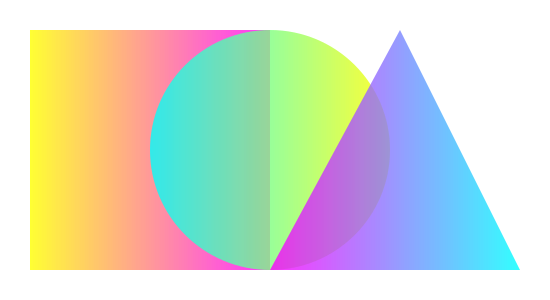
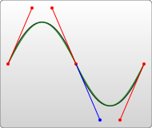

class: middle, center

# SVG

陈一帅

实务学堂

.footnote[Web前端]

---
# 介绍

- 编程真的是什么都能干
- 本节我们学习如何通过写程序，画图，这就是SVG图
- 通过这种方法得到的图像，它的分辨率是无限大的，也就是说：不管你怎么放大，图片永远清晰。厉害吧

---
# 作品

- 先请大家欣赏一副作品
- [外星人来了](../svg/alien-invasion/index.html)

---
# 介绍

- Scalable Vector Graphics：可缩放矢量图形
- 一种XML语言
- 文本，曲线，形状
.center[.width-30[]]
<!-- .center[.width-30[]] -->

???

SVG诞生于1999年，之前有几个相互竞争的格式规范被提交到W3C，但是都没有获得批准。主流浏览器均支持SVG。加载慢是SVG的一个缺点。但是SVG也有自身的优点，比如它实现了DOM接口（比Canvas方便）

提供了一些元素，用于定义圆形、矩形、简单或复杂的曲线。一个简单的SVG文档由 svg 根元素和基本的形状元素构成。另外还有一个g元素，它用来把若干个基本形状编成一个组。

SVG is a language for describing two- dimensional graphics in XML
SVG allows for three types of graphic objects: vector graphic shapes, images, and text
SVG drawings can be interactive, dynamic, and animated

---
# SVG

- 元素渲染顺序
  - SVG文件全局有效的规则是“后来居上”，越后面的元素越可见。
- 区分大小写
- 属性值必须用引号引起来，就算是数值也必须这样做。

---
# 可扩展

- 放大缩小，清晰度不变

.center[.width-30[]]

???

- To be scalable means to increase or decrease uniformly
In terms of graphics, means not being limited to a single, fixed, pixel size
On the Web, scalable means that a particular technology can grow
SVG is scalable in both senses of the word

向量

Vector graphics contain geometric objects such as lines and curves
This gives greater flexibility compared to raster-only formats
Since all modern displays are raster- oriented, the difference between raster-only and vector graphics comes down to where they are rasterized
Vector graphics are rasterized client side; raster graphics are, by nature, already rasterized on the server

图形

Most existing XML grammars represent either textual information or raw data
They typically provide only rudimentary graphical capabilities
SVG provides a rich, structured description of vector and mixed vector/ raster graphics

优点

SVG images can be created and edited with any text editor
SVG images can be searched, indexed, scripted, and compressed
SVG images are scalable, can be printed at any resolution, and are zoomable without degradation
SVG is an open standard
SVG files are pure XML

---
# XML

- Extensible Markup Language
- 像 HTML

???

XML stands for Extensible Markup Language
XML is a markup language much like HTML
XML was designed to carry data, not to display data
XML tags are not predefined. You must define your own tags
XML is designed to be self-descriptive
SVG is written in XML

---
# 坐标系统

- 所有计算机绘图都差不多
  - 页面左上角为(0,0)坐标点
  - 坐标以像素为单位
  - x轴正方向是向右
  - y轴正方向是向下

.center[.width-30[]]

???

---
# SVG 画矩形

- 这和你小时候所教的绘图方式是相反的。但在HTML文档中，元素都用这种方式定位
- 定义一个矩形，从左上角开始，向右延展100px，向下延展100px，形成一个100*100大的矩形

```xml
<rect x="0" y="0" width="100" height="100" />
```

<svg width="300" height="200">
  <rect x="0" y="0" width="100" height="100" />
</svg>

---
# SVG 画矩形

```xml
<svg width="300" height="200">

  <!-- 绘制一个完全覆盖图像区域的矩形，背景设为红色 -->
  <rect width="100%" height="100%" fill="red" />
</svg>

```
<svg width="300" height="200">

  <!-- 绘制一个完全覆盖图像区域的矩形，背景设为红色 -->
  <rect width="100%" height="100%" fill="red" />
</svg>

---
# 圆圈

- 向右cx：偏移90px；向下cy：偏移90px
- 半径r：40px
- 填充fill：绿色 green

```xml
<circle cx="90" cy="90" r="40" fill="green"/>
```
<svg>
  <rect width="100%" height="100%" fill="red" />
  <circle cx="90" cy="90" r="40" fill="green"/>
</svg>
---
# 文字

- 填充（fill）为白色（red）
- 文本（text）锚点（anchor）居中（middle）
- 精细调整字体（font）大小（size）
- 垂直位置（x，y）

```xml
  <text x="150" y="85" font-size="60"
      text-anchor="middle" fill="red"> 实务学堂
  </text>
```
<svg>
  <rect width="100%" height="100%" fill="green" />
  <text x="150" y="85" font-size="60"
      text-anchor="middle" fill="red"> 实务学堂
  </text>
</svg>

---
# 线

```xml
  <line x1="10" x2="50" y1="110" y2="150"
  stroke="orange" fill="transparent"
  stroke-width="5"/>
```
<svg>
  <line x1="10" x2="50" y1="110" y2="150" stroke="orange" fill="transparent" stroke-width="5"/>
</svg>

---
# 折线

```xml
  <polyline points="60 110 65 120 70 115 75
    130 80 125 85 140 90 135 95 150 100 145"
    stroke="orange" fill="transparent"
    stroke-width="5"/>
```
<svg>
  <polyline points="60 110 65 120 70 115 75 130 80 125 85 140 90 135 95 150 100 145"
      stroke="orange" fill="transparent" stroke-width="5"/>
</svg>

---
# 椭圆

```xml
  <ellipse cx="75" cy="75" rx="20" ry="5"
  stroke="red" fill="transparent"
  stroke-width="5"/>
```
<svg>
  <ellipse cx="75" cy="75" rx="20" ry="5" stroke="red" fill="transparent" stroke-width="5"/>
</svg>

[MDN](https://developer.mozilla.org/zh-CN/docs/Web/SVG/Tutorial/Basic_Shapes)

---
# 路径

- 最常见的SVG元素
- 可用path绘制矩形（直角矩形或者圆角矩形）、圆形、椭圆、折线形、多边形，以及一些其他的形状，例如贝塞尔曲线、2次曲线等曲线。
- 很强大，很复杂
- 只需要设定很少的点，就可以创建平滑流畅的线条（比如曲线）
  - polyline元素也能实现类似的效果，但必须设置大量的点（点越密集，越接近连续，看起来越平滑流畅），并且这种做法不能够放大（放大后，点的离散更明显）。所以在绘制SVG时，对路径的良好理解很重要。

???

The <path> element is foundational to drawing with SVG; it allows you to
create all kinds of shapes.

---
# Path

- 通过属性d定义
- 属性d的值是一个“命令+参数”的序列

???

The shape of a <path> element is
defined by one attribute: d
The d attribute contains a series of commands and parameters used by those commands.

All of the commands also come in two variants: an uppercase letter specifies absolute coordinates; a lowercase letter specifies relative coordinates.

---
# 命令+参数

- 每一个命令都用一个关键字母来表示
  - 字母“M”表示的是“Move to”命令
  - 当解析器读到这个命令时，它就知道你是打算移动到某个点
- 跟在命令字母后面的，是你需要移动到的那个点的x和y轴坐标
  - “M 10 10”：移动到(10,10)这个点
  - 这一段字符结束后，解析器就会去读下一段命令

---
# 命令

- 每一个命令都有两种表示方式
- 大写字母，表示采用绝对定位
- 小写字母，表示采用相对定位
  - 从上一个点开始，向上移动10px，向左移动7px
- 因为属性d采用的是用户坐标系统，所以不需标明单位。

---
# Path 命令

- M：move to 移动
- L：line to 连线
- H：horizontal line to 水平连线
- V：vertical line to 垂直连线
- C：curve to 曲线

[MDN](www.w3.org/TR/SVG/paths.html)

???
- S：smooth curve to 平滑曲线
- Q：quadratic Bézier curve
- T：smooth quadratic Bézier curveto A elliptical a rc
- Z：closepa th


---
# 移动命令 M

- M命令是移动画笔位置，但是不画线
- 两个参数，分别是需要移动到的点的x轴和y轴的坐标
- 常出现在路径的开始处，用来指明从何处开始画

---
# 画线：Line to

- 在当前位置和新位置（L前面画笔所在的点）之间画一条线
- L需要两个参数，分别是一个点的x轴和y轴坐标
- 两个简写命令，用来绘制水平线和垂直线
  - H，绘制水平线
  - V，绘制垂直线
  - 都只带一个参数，标明在x轴或y轴移动到的位置，因为它们都只在坐标轴的一个方向上移动。

---
# 例

- 矩形（同样的效果用<rect/>元素可以更简单的实现）

```xml
  <path d="M10 10 H 90 V 90 H 10 L 10 10"/>
```
<svg>
  <path d="M10 10 H 90 V 90 H 10 L 10 10"/>
</svg>

---
# Z 闭合

- 可通过“闭合路径命令”Z来简化上面的path
- Z命令会从当前点画一条直线到路径的起点
- 尽管我们不总是需要闭合路径，但是它还是经常被放到路径的最后
- Z命令不用区分大小写。

```xml
<path d="M10 10 H 90 V 90 H 10 L 10 10"/>
可以简化为：
<path d="M10 10 H 90 V 90 H 10 Z"/>
或者采用相对
<path d="M10 10 h 80 v 80 h -80 Z"/>
```

---
# 讨论：下面代码的图像是？
```xml
<path d="
        M 20 20
        H 180
        V 180
        H 20
        z">
  </path>
```
---
# 讨论：下面代码的图像是？
```xml
<path d="
        M 100 0
        h 100
        v 100
        h 100
        v 100
        h -100
        v 100
        h -100
        v -100
        h -100
        v -100
        h 100
        z">
  </path>
```

---
# 示例

- [十字架](../svg/0-svg-icon.html)

---
# 曲线

- 两种贝塞尔曲线
  - 三次贝塞尔曲线C
  - 二次贝塞尔曲线Q

---
# 三次贝塞尔曲线

- 需定义一个曲线终点和两个控制点
- 控制点描述的是曲线起始点的方向
- 曲线上各个点的方向，是从起点方向逐渐变到终点方向

.center[.width-50[]]

---
# 三次贝塞尔曲线

- C命令，三组坐标参数
  - C x1 y1, x2 y2, x y
  - c dx1 dy1, dx2 dy2, dx dy
- (x,y)表示曲线终点
- (x1,y1)是起点的控制点
- (x2,y2)是终点的控制点

---
# 曲线

```xml
   <path d=" M 20 40
        L 100 20
        L 175 125
        L 120 180
        C 40 150 70 50 20 40">
    </path>
```
- [曲线](../svg/1-svg-path.html)

---
# S 命令

.center[.width-30[]]

- 将若干个贝塞尔曲线连起来，创建出一条很长的平滑曲线
  - 一个点某一侧的控制点是它另一侧的控制点的对称（以保持斜率不变）
  - 如果S命令跟在一个C或S命令后面，则它的第一个控制点会被假设成前一个命令曲线的第二个控制点的中心对称点。
  - 如果S命令单独使用，前面没有C或S命令，那当前点将作为第一个控制点。

---
# S命令

- 下面是S命令的语法示例，图中左侧红色标记的点对应的控制点即为蓝色标记点。

```xml
<path d="M10 80
      C 40 10, 65 10, 95 80
      S 150 150, 180 80"/>
```

<svg>
<path d="M10 80 C 40 10, 65 10, 95 80 S 150 150, 180 80"/>
</svg>

---
# Q

- 二次贝塞尔曲线Q
- 比三次贝塞尔曲线简单，只需要一个控制点，用来确定起点和终点的曲线斜率
- 因此它需要两组参数，控制点和终点坐标。

[MDN Path](https://developer.mozilla.org/zh-CN/Web/SVG/Tutorial/Paths)

[MDN SVG](https://developer.mozilla.org/zh-CN/docs/Web/SVG/Tutorial)

<!-- Lab: SVG Paths 2-path -->

---
# 工具

- Adobe Illustrator
- Inkscape
- Affinity
- [clker SVG 编辑器](http://www.clker.com/inc/svgedit/svg-editor.html)

---
# 剪切

- clip-path

[爱心](../svg/8-clip/svg-heart.html)

---
# 设置风格

- 类似CSS，设置图片风格

- 颜色过渡：lineargradient
  - [Shape](../svg/1-svg-shape.html)
  - [Multi-Shape](../svg/5-svg-shape.html)
- 自带滤镜：filter
  - [Circle](../svg/1-svg-circle.html)
  - [Multi Circle](../svg/3-svg-circle.html)

???
The advantages of style sheets are now generally accepted, certainly for use with text
SVG extends this control to the realm of graphics
It allows for script-based manipulation of the document tree and the style sheet

---
# 动画

.center[.width-70[]]

???

SVG supports the ability to change vector graphics over time
Using SVG’s animation elements, you can define motion paths, fade-in or fade-out effects, and objects that grow, shrink, spin or change color
SVG has been designed to allow SMIL to use animated or static SVG content as media components
Support for SMIL animation may be waning in favor of CSS animation

```css
    <style>
      path {
        animation: draw 3s linear forwards;
        stroke: black;
        stroke-dasharray: 800;
      }

      @keyframes draw {
        0% {
          stroke-dashoffset: 800;
          fill-opacity: 0;
        }
        80% {
          stroke-dashoffset: 0;
          stroke-opacity: 1;
          fill-opacity: 0;
        }
        100% {
          stroke-opacity: 0;
          fill-opacity: 1;
        }
      }
```

circles.svg

```xml
<circle class="c1" cx="161.25" cy="38.75" r="12.37" transform="translate(19.83 125.37) rotate(-45)"/>
  <circle class="c2" cx="186.63" cy="100" r="12.38"/>
```

```css
      @keyframes fade {
        0% {fill-opacity: 0}
        40% {fill-opacity: 1}
        80% {fill-opacity: 0}
        100% {fill-opacity: 0}
      }

      circle {
        fill-opacity: 0;
        stroke: black;
        animation-name: fade;
        animation-duration: 2s;
        animation-iteration-count: infinite;
      }

      .c2 {animation-delay: 125ms;}
```

嵌入网页

There are a variety of ways in which SVG content can be included within a Web page
• A stand-alone SVG Web page
• Embedding by reference, using the HTML ‘img’ element
• Embedding inline
• External link, using the HTML ‘a’ element
• Referenced from a CSS property

web上的svg文件可以直接在浏览器上展示，或者通过以下几种方法嵌入到HTML文件中：
如果HTML是XHTML并且声明类型为application/xhtml+xml，可以直接把SVG嵌入到XML源码中。
如果HTML是HTML5并且浏览器支持HTML5，同样可以直接嵌入SVG。然而为了符合HTML5标准，可能需要做一些语法调整。
可以通过 object 元素引用SVG文件：
        <object data="image.svg" type="image/svg+xml" />
类似的也可以使用 iframe 元素引用SVG文件：
        <iframe src="image.svg"></iframe>
理论上同样可以使用 img 元素，但是在低于4.0版本的Firefox 中不起作用。
最后SVG可以通过JavaScript动态创建并注入到HTML DOM中。 这样具有一个优点，可以对浏览器使用替代技术，在不能解析SVG的情况下，可以替换创建的内容。

---
# 练习

- 为学堂设计一个图标

