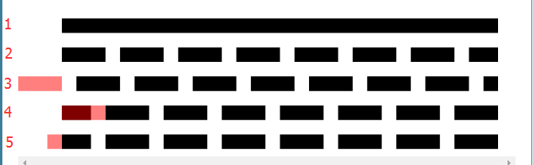

class: middle, center

# CSS动画

陈一帅

实务学堂

.footnote[Web前端]

---
# 介绍

- 过渡可以产生动画效果
- 关键帧可以指定动画的起始、中间、结束位置
- SVG可以用CSS设定动画

---
# 关键帧动画

- @keyframes动画规则
  - 指定动画的起始、中间、结束位置
  - 指定CSS样式，动画将逐渐完成样式的改变

```css
@keyframes rotation {
  from {transform: rotate(0deg);}
  to {transform: rotate(360deg);}
}
```

---
# 为HTML元素设置动画属性

```css
.compass {
  animation-name: rotation;     # 动画名
  animation-duration: 2s;       # 时长
  animation-iteration-count: infinite;  # 循环次数
  animation-timing-function: linear;  # 线性
  animation-direction: normal;  # 方向
}
```
简写
```css
animation: rotation 2s infinite linear normal;
```

[例：二维旋转动画](../css-animation/2d-rotate.html)

---
# 动画控制

- animation-play-state
  - paused （暂停）
  - running （运行）

---
# 浏览器前缀

- 供应商前缀
  - webkit
  - moz
  - ms
  - o
- 允许浏览器制造商实验各种CSS声明
  - 即使细节未标准化，也可以实施新属性

---
# 动画变换的简写

```css
0% {transform: translate(-400px, 300px);
      opacity: 0;}
33% {transform: translate(400px, 200px)
      rotate(0deg);
      opacity: 1;}
```

[例：超炫花样滑板](../css-animation/skate.html)

---
# 动画完成后

- animation-fill-mode
  - 保持住：forwards;
  - 回到原点：backwards;

[例：超炫花样滑板](../css-animation/skate.html)

---
# SVG CSS 动画

```css
@keyframes fade {
  0% {fill-opacity: 0}
  40% {fill-opacity: 1}
}
circle {
  fill-opacity: 0;
  stroke: black;
  animation-name: fade;
}
.c2 {animation-delay: 125ms;}
```

[例：动图圆圈](../css-animation/circles.svg)

---
# SVG 线条动画

- 基于虚线
  - 虚线长900 (stroke-dasharray: 900)
  - 左偏900，隐藏 (stroke-dashoffset: 900)
  - 动画控制偏移，逐渐出现

.center[.width-80[]]

[例：动画SVG画笔](../css-animation/earth-animated.svg)

---
# 练习1

- 为你的莲花加上动画控制：
  - 当鼠标放到莲花上时，莲花暂停旋转
- 提示
  - 可以利用 animation-play-state

---
# 练习2

- 给你的SVG作品，加上动画
- 要求
  - 有CSS动画
  - 有线条动画

---
# 参考

[W3school CSS 动画](http://www.w3schools.com.cn/css3/css3_animations.asp)

[SVG线条动画](https://www.cnblogs.com/daisygogogo/p/11044353.html)
