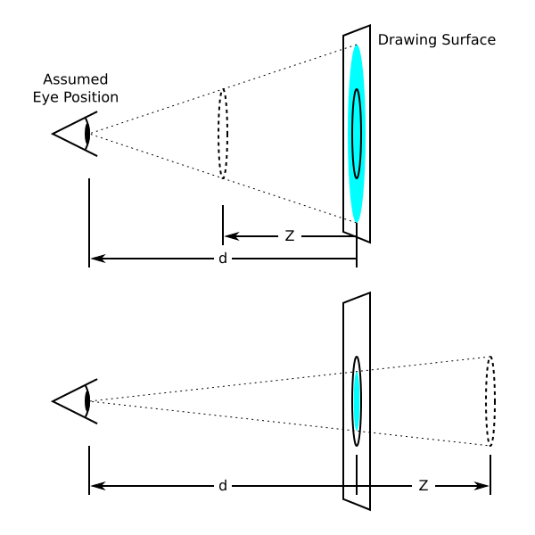
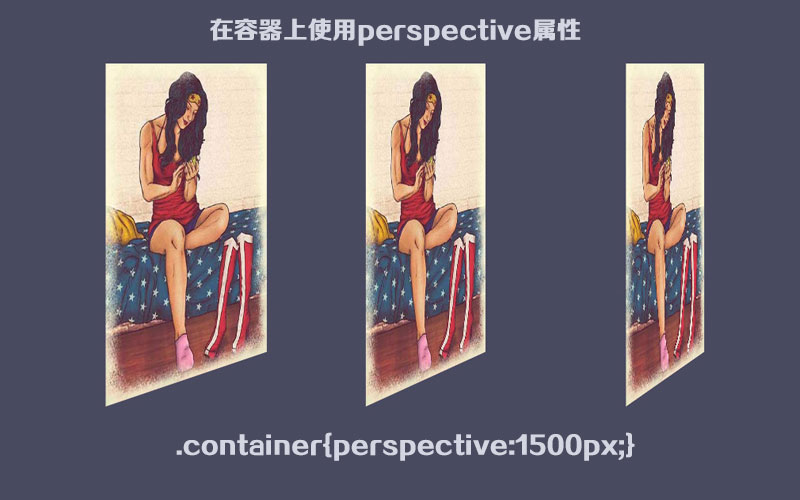
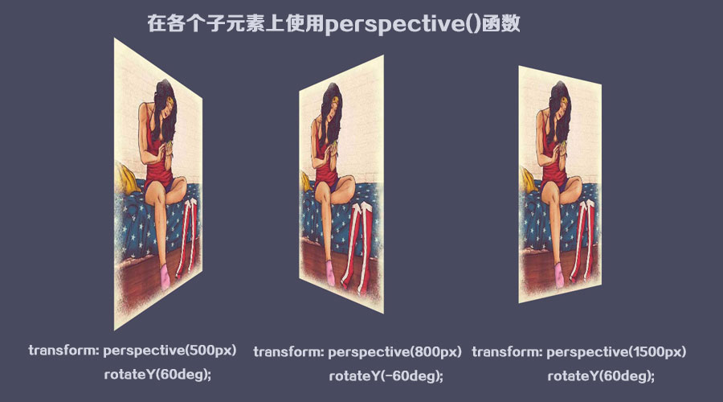
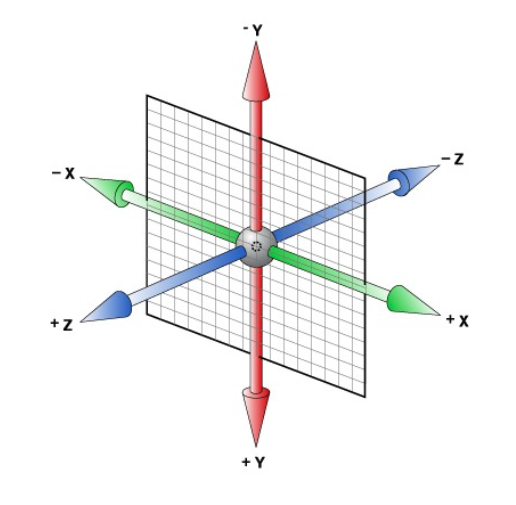

class: middle, center

# CSS 3D变换

陈一帅

实务学堂

.footnote[Web前端]

---
# 介绍

- 利用CSS进行2维平面、3维空间的各种变换，创造属于你的虚拟世界
- 先请大家欣赏一副作品
- [花瓣](../css-transform/lab/flower.html)

---
# 长度单位

- CSS中有两种长度单位，相对长度和绝对长度。
- 相对单位
  - em（相对于字体大小）
  - ％（相对于包含元素）
- 绝对单位
  - px（像素）
- 其它
  - 自动 auto（浏览器计算长度）
  - 继承 inherit（从父元素）

???

There are two types of length units in CSS, relative and absolute.
Relative units of length include:
• em (relative to font size)
• % (relative to the containing element)
Absolute units of length include:
• px (pixels)
Alternatively specifications:
• auto (browser calculates length)
• inherit (from the parent element)

---
# CSS3 Transforms

- 移动，缩放，旋转，旋转和拉伸元素
- 使元素改变形状，大小和位置
- 二维和三维

---
# 2D变形

- 两个主要属性
  - 变形方法 transform
  - 变形中心点 transform-origin

```css
  transform: rotate(90deg);
  transform-origin: bottom left;
```

[2D变形示例：指南针](../css-transform/lab/2d.html)

[W3School 2D 变形](https://www.w3school.com.cn/css3/css3_2dtransform.asp)

---
# 变形方法

- transform 指定变形方法
  - translate：平移
  - rotate：旋转
  - scale：缩放
  - skew：偏斜
- 可以指定用空格分隔的一系列变形
```css
  transform: skewx(10deg) translatex(150px);
```
  - 会分别执行

- 实验：[2D变形-方形](../css-transform/lab/2d-rect.html)

---
# 变形中心点

- 旋转，缩放和倾斜，都需要中心点
- 默认为元素中心
- transform-origin 设定
```css
  transform-origin: bottom left;
```

- 实验：[2D变形-方形](../css-transform/lab/2d-rect.html)

---
# 3D变形

- 先设置透视点（perspective），配置3D透视空间
- 再定义 2D 元素在空间中的行为（旋转等）

.center[.width-60[]]

---
# 3D透视原理

- 透视是三维空间立体感的源泉
  - CSS定义元素大小（比如200px）
  - 但物体在屏幕上的大小，和物体位置有关

.center[.width-50[]]

---
# 3D透视原理

- 眼睛位置，透视度（d：眼睛到屏幕的距离），图像位置（ z：图像到屏幕的距离），共同决定屏幕上对象会画多大，怎么画

.center[.width-60[]]

---
# 透视度

- d（perspective）：眼睛到屏幕的距离
  - d越大，立体效果越弱，屏幕上的和实际的差不多
  - d越小，立体效果越强，屏幕上的和实际的差很多

.center[.width-40[]]

---
# 透视度

[Des示例](https://3dtransforms.desandro.com/perspective)

[MDN 透视度示例](https://developer.mozilla.org/zh-CN/docs/Web/CSS/perspective)

[HTML Leaf示例](http://www.htmleaf.com/ziliaoku/qianduanjiaocheng/perspective.html)

---

# 元素设置

- 给一个元素设上透视度，就把它转换到了3D空间里了
- 有两种方法设置
- 父元素上设 perspective，将其作为3D空间
  - 它里面的所有子元素都共享这个3D空间
- 在元素自身上使用perspective()函数
  - 元素具有自己的3D透视空间

---
# 例

- 父元素上使用 perspective
- scene的所有子元素共享一个3D空间和消失点

```css
.scene {
  width: 200px;
  height: 260px;
  perspective: 600px;
}
```

---

# 父元素上使用 perspective

- 所有子元素共享一个3D空间和消失点
- 例：各个元素使用rotateY()函数沿Y轴旋转60度
  - 左边的图片能够看到更多一些，因为眼睛在中间

.center[.width-80[]]

---
# 子元素各自使用 perspective

- 各个子元素有各自的3D空间和消失点
- d=500px, 800px, 1500px
  - d小，立体感强

.center[.width-80[]]

---
# 子元素透视继承

- 元素的perspective仅适用于直接后代
- 为了让后续孩子继承父母的视角并生活在同一个3D空间中，父母可以使用transform-style：preserve-3d 传递其视角

```css
  transform-style: preserve-3d;
```

[MDN](https://developer.mozilla.org/zh-CN/docs/Web/CSS/transform-style)

???

把 width: 100%; and height: 100%; so the card’s transform-origin will occur in the center of container

---
# 眼睛位置

- 眼睛位置不一样，立体效果也不一样
  - 默认情况下，眼睛在3D空间的正中间
- 也叫消失点

.center[.width-50[]]

---
# 眼睛位置

- 可以用 perspective-origin 设定眼睛位置
- 两个参数：水平位置，垂直位置
  - 25% 75%
  - center left

[MDN 示例](https://developer.mozilla.org/zh-CN/docs/Web/CSS/CSS_Transforms/Using_CSS_transforms)

[HTML Leaf示例](http://www.htmleaf.com/ziliaoku/qianduanjiaocheng/perspective-origin.html)

---
# Z值

- 设定了元素相对于屏幕的位置

.center[.width-70[]]
---
# Z值

- 屏幕的Z = 0
- 观察者后面，即Z大于d的部分，不会画出来

.center[.width-50[]]

---
# 3D空间

- x轴：水平向右，为正
- y轴：垂直向下，为正
- z轴：垂直屏幕出来，为正

.center[.width-50[]]

---
# 变化Z，产生3D动画

- 变化Z，元素离屏幕的远近就会变化
- 在屏幕上画出来的图像随之变化，产生3D感

.center[.width-60[]]

---
# 沿着Z轴移动和旋转

- 沿着Z轴移动
  - translateZ(100px)
- 沿着Z轴旋转
  - rotateZ( angle )

[Des 3D 变换示例](https://3dtransforms.desandro.com/3d-transform-functions)

[Des Cube 示例](https://3dtransforms.desandro.com/cube)

---
# 3d变换

- X，Y，Z同时变换
- 平移 translate3d( tx, ty, tz )
- 缩放 scale3d( sx, sy, sz )

---
# 3D旋转

- rotate3d ( rx, ry, rz, angle )
  - x, y, z: 0到1之间的数值，表示旋转的轴
  - angle: 角度，正值顺时针，负值逆时针

例：绕Y轴旋转60度
```css
transform: rotate3d(0, 1, 0, 60deg);
```

[MDN rotate3d](https://developer.mozilla.org/zh-CN/docs/Web/CSS/transform-function/rotate3d)

[实验：3D变换](../css-transform/lab/3d.html)

---
# Cubic

- 如何显示各面
- 如何旋转
  - 先单轴
  - 再双轴
- translateZ推回

```css
transform: translateZ(-100px) rotateX(  90deg);
```

[Cube 课堂练习](../css-transform/lab/cube.html)

[Des Cube 教程](https://3dtransforms.desandro.com/cube)

---
# 字体不清晰

- 为了解决文字失真并恢复立方体的像素完美，我们可以向后推3D对象，以便将有文字的正面定位在Z=0的原点处

```css
.cube { transform: translateZ(-100px); }
```

---
# 背面不显示

- 当它们远离观看者，进入背面时，隐藏它们

```css
  backface-visibility: hidden;
```

[Des Card Flip 教程](https://3dtransforms.desandro.com/card-flip)

---
# Flower

[花瓣](../css-transform/lab/flower.html)

---
# 练习

- 请雷涵收集上周大家创造的SVG图片，分发给大家
- 将上周大家SVG作品，做成一朵花，每个花瓣上，是一个同学的作品
- 要求
  - 该花会旋转，显示各同学的作品
  - 鼠标移到花上时，旋转停止

---
# 参考

[MDN](https://developer.mozilla.org/zh-CN/docs/Web/CSS/CSS_Transforms/Using_CSS_transforms)

[W3school 3D Transform](https://www.w3school.com.cn/css3/css3_3dtransform.asp)

???

应用视觉设计介绍

https://learn.freecodecamp.one/responsive-web-design/applied-visual-design

---
# 练习

Drawing
Using shapes coded with CSS, create a three-dimensional drawing (other than a cube) of an abstract or representational form. Your drawing should employ CSS transforms with 3D perspective to create at least six shapes that exist on the X, Y, and Z axes. Taken together, these shapes can create abstract polyhedron of varying complexity or familiar forms such as a bird, tree, flower, or building. The drawing should be created exclusively with HTML and CSS and, as usual, must be designed and coded by you.

Animation
Once you’ve completed the drawing, animate it using the CSS @keyframes rule. You may choose to animate the entire drawing or isolated aspects of it. You might also animate multiple copies of your original drawing to create a more scenic effect in the browser window. Finally, add a CSS transition in response to a user gesture such as the :hover or :active peudoclasses.

Beyond these requirements, feel free to add additional CSS and/or raster graphics to complete your drawing.

---
# 要求

A new web page with a custom CSS drawing (1 point)
The drawing should employ three-dimensional CSS transforms with perspective (2 points)
The drawing should include at least six shapes (3 points)
The drawing should be animated with the @keyframes rule (3 points)
The drawing should include a CSS transition in response to a user gesture (1 point)