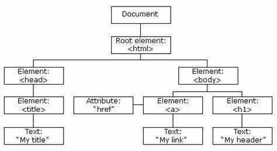

class: middle, center

# 定时器

陈一帅

实务学堂

.footnote[Web前端]

---
# 介绍

- 手机里有定时器，到时提醒
- 网页里也可以这么做
- 本节我们学习如何通过用JS设置定时器，实现各种动画
- 除了动画，定时器也有其它很多用途

---
# 作品

- 先请大家欣赏一副作品
- 背景周期变化
- 文字逐个出现，左移
  - TypeIt 动画效果

[定时器示例](../js-timer/quietudes/index.html)

???

- [JS个人主页](https://quietudes.github.io)
- [Github代码下载](https://github.com/quietudes/quietudes.github.io)

---
# TypeIt动画效果JS实现

- 每次出现一个字
- 背景知识
  - 字符串数组

---
# 字符串数组

- 字符串是一个数组

```js
var txt = "(安静的房间)";
```

- 取i位置的字符

```js
txt.charAt(i);
```

- 获得字符串的长度

```js
txt.length
```

---
# 字符串的逐字访问

- 循环访问字符串中每一个字

```js
var i = 0;
for (i = 0; i < txt.length; i++){
  console.log(txt.charAt(i))
}
```

---
# 附加

- 每次取字符串的一个字，添加到另外一个字符串后面
- 用 += 操作符，叠加

```js
var i = 0;
var x;
for (i = 0; i < txt.length; i++){
  console.log(x += txt.charAt(i))
}
```

---
# 介绍

- DOM表示网页的文档模型
  - 文档对象模型 （Document Object Model）
- 当浏览器加载网页时，它会创建该网页的模型
- JavaScript程序可以对其进行修改，更改可见的文档
- JavaScript可以通过设置style属性来修改元素样式

---
# DOM Tree

- DOM像一棵树一样组织，其中元素根据文档的结构分层排列
- 该模型被称为“DOM树”，存储在浏览器的内存中

---
# DOM Tree

- HTML中的每个元素（element），属性（attribute）和文本（text）都由其自己的“DOM节点”表示
.center[.width-100[]]

  - 节点之间的空白也被创建了文本节点

???
When a browser loads a web page, it creates a model of that page
This is called a “DOM tree” and it is stored in the browser’s memory
Every element, attribute, and piece of text in the HTML is represented by its own “DOM node”

---
# DOM 节点类型

- 文档节点，代表整个页面
- 元素节点，代表单个HTML标签
- 属性节点，代表HTML标签的属性，例如class
- 文本节点，表示元素内的文本，例如p标签的内容

.center[.width-70[]]

---
# DOM 节点类型

- 每个DOM节点对象都有一个nodeType属性，该属性包含标识节点类型的代码（数字）
- 元素
  - 代码1，Node.ELEMENT_NODE
- 文本
  - 代码3，Node.TEXT_NODE
- 注释
  - 代码8，Node.COMMENT_NODE

???

示例文档的<body>标记不仅有3个子元素（<h1>和2个<p>元素），而且实际上有7个：这3个元素，以及它们之前，之后和之间的空格。

---
# DOM操作：查找

- 找到ID为"title"的HTML元素

```js
getElementById("title")
```

  - 类似JQuery的 $("#title")

---
# DOM操作：读取

- 获得元素后，可以像JQuery一样，读取和设置它的各种属性
- 如：读取元素的HTML内容

```js
var t = document.getElementById("title");
t.innerHTML
```

- 也可以连着写，写为

```js
document.getElementById("title").innerHTML
```

---
# DOM操作：设置

- 可以设置元素的各种属性
- 如：设置元素HTML内容

```js
t.innerHTML = "<h1>Hello</h1>";
```

- 也可以连着写，写为

```js
document.getElementById("title").innerHTML
          = "<h1>Hello</h1>"
```

---
# DOM操作：设置

- 设置文本

```js
t.innerText = "<h1>Hello</h1>";
```

---
# 练习1

- 打开下面的网页，进入控制台
- 进入Source，开始源代码调试
- 设置断点，刷新页面，确保在断点处停止
- 实验各种DOM操作，观察效果

[DOM简单练习](../js-timer/template.html)

---
# 函数

```js
function 你好(){
  console.log("Hello！");
}
```

---
# 定时器

- 计划在给定的毫秒数后，调用一个函数
- 例：1000毫秒（也就是1秒）后，调用函数“你好”

```js
setTimeout(你好, 1000);
```

---
# 定时器

```js
function go() {
  text.textContent += ' 好玩，Go!';
}
setTimeout(go, 2000);
```

[定时回复示例](../js-timer/timeout.html)

---
# 说完再说

- 在函数“你好”里，说完“Hello”后，再设定时器，1秒后再调自己，再说“Hello”
- 就永远说下去了

```js
function 你好() {
    console.log("Hello！");
    setTimeout(你好, 1000);
}
你好();
```

---
# 练习2

- 修改 [定时回复示例](../js-timer/timeout.html)，让它一直回复下去
- 要求
  - 每隔4秒，回复一句

---
# 只说3遍

```js
var i = 0
function 你好() {
  if (i<3){
    console.log("Hello！");
    setTimeout(你好, 1000);
    i++;
    }
}
你好();
```

---
# 练习3

- 修改 [定时回复示例](../js-timer/timeout.html)，让它只回复三遍
- 要求
  - 每隔4秒，回复一句

---
# 实例：科蚪专属放松平台

- valueOf() 取得当前标签的文字值

[实例：科蚪专属放松平台](../js-timer/quietudes/breathe.html)

[代码](../js-timer/quietudes/assets/js/breathe.js)

---
# 清除

- 有时您需要取消定时器
- 首先存储setTimeout返回的值
- 后面就可以对它调用clearTimeout来取消它
- 注意下面是箭头函数

```js
let bombTimer = setTimeout(() => {
  console.log("即将爆炸!"); }, 500);
if (Math.random() < 0.5) {
  // 50% 的机会
  console.log("拆除成功.");
  clearTimeout(bombTimer);
}
```

---
# 练习4

- 修改[炸弹示例](../js-timer/bomb.html)，加上炸弹效果
- 再添加一个元素，如果随机数大于等于0.5，把该元素内容设置为 💥
- 提示
  - 💥 是一个可以粘贴的字符，不是一个图片。就把它当文字就可以。

---
# 重复计时器

- 也可以设置会自动重复的计时器
  - setInterval用来设置每X毫秒重复一次的计时器
  - clearInterval 可以清除该计时器

```js
let ticks = 0;
let clock = setInterval(() => {
  console.log("滴答", ticks++);
    if (ticks == 10) {
      clearInterval(clock);
      console.log("停止.");
  }
}, 200);
```

[重复计时器示例](../js-timer/dida-interval.html)

---
# 重复计时器

```js
let animation = setInterval(skate, 4);
function skate() {
  skater.style.top = position + 'px'; // CSS top property
  skater.style.left = position + 'px'; // CSS left property
```

[滑板定时器示例](../js-timer/interval.html)

[示例](../js-timer/set-interval.html)

---
# 练习5

- 修改[炸弹示例](../js-timer/bomb.html)，变成每隔1秒出一个炸弹。
- 10个炸弹后，显示“轰炸完成，回家吃饭！”

---
# 科蚪专属写作平台

[科蚪专属写作平台](../js-timer/quietudes/write.html)

[代码](../js-timer/quietudes/assets/js/write.js)

---
# 监控用户输入

- 用户每在input输入框里敲一个键，当键弹起的时候（keyup），就会调用函数 function
  - 注意这个函数是一个匿名函数
  - 有一个参数e，这个里面存着这个键的一些信息
- 这个函数再调用 wordCounter 函数

```js
input.addEventListener('keyup', function(e){
  wordCounter(e.target.value);
});
```

---
# 字数统计

- wordCounter 函数先获取用户输入的文本

```js
document.getElementById('input').value
```

- 然后用正则表达式提取里面的单词个数

```js
text.match(/\S+/g).length
```

---
# 正则表达式

- 提取符合某种模式的字符串
- 比如

```js
var x = "科蚪 帅哥们 你们 好吗？";
console.log(x.match(/\S+/g));
```

---
# 正则表达式

```js
console.log(x.match(/\S+/g));
```

- \S: 非空白字符（空格，Tab键）
- \+：出现至少一次
  - 加号是追加的意思，得先有一个，然后才能追加
- g：修饰符，表示全局匹配
  - 按顺序找到.red[所有]满足匹配模式的所有子串，强调“所有”，而不只是“第一个”。g是单词global的首字母

[正则表达式字符匹配攻略](https://zhuanlan.zhihu.com/p/27338649)

---
# 练习6：FCC正则表达式

[FCC练习](https://learn.freecodecamp.one/javascript-algorithms-and-data-structures/regular-expressions)

- 30个练习，需要3个小时左右

---
# 进度条显示

```js
var bar = document.getElementById("innerBar");
document.getElementById("innerBar")
                .style.width = '100%'
```

---
# 定时更新页面上显示的时钟

- 定时更新

```js
var t = setTimeout(startTime, 1000);
```

- 采用面向对象的语法，获得当前的日期和时间

```js
var today = new Date();
var h = today.getHours();
var m = today.getMinutes();
```

---
# 时间显示格式统一

- 9点8分，会显示为09:08
- 所以，如果获得的小时和分钟是一位数（比如9），就要在前面加”0“

```js
function checkTime(i) {
  if (i < 10) {i = "0" + i};
  return i;
}
```

---
# 护眼模式

- 如果用户点击月亮☽和太阳☀的元素的话，更换显示模式
- 用 onclick 设置响应函数
  - 类似JQuery的click()

```js
var moon = document.getElementById("moon");
moon.onclick = function darkMode() {
```

---

# 两种模式

- 亮模式和暗模式
- 设置背景色和文本色

```js
document.documentElement.style
        .setProperty('--bg-color', '#303030');
document.documentElement.style
        .setProperty('--text-color', '#e3e3e3');
```

---

# 练习7

- 修改 [科蚪专属放松平台](../js-timer/quietudes/breathe.html)，在上面实时显示现在的时间。如果太晚，显示警告：“同学明天再做也来得及！赶紧睡觉”
- 修改 [科蚪专属写作平台](../js-timer/quietudes/write.html)，在上面显示计时器，计时器倒计时30分钟，5分钟的时候，背景变为黄色；0分钟的时候，显示炸弹