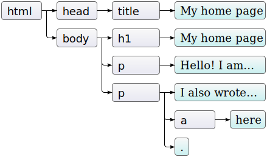

class: middle, center

# Javascript DOM

陈一帅

实务学堂

.footnote[Web前端]

---
# 介绍

- DOM表示网页的文档模型
  - 文档对象模型 （Document Object Model）
- 当浏览器加载网页时，它会创建该网页的模型
- JavaScript程序可以对其进行修改，更改可见的文档
- JavaScript可以通过设置style属性来修改元素样式

---
# DOM Tree

- DOM像一棵树一样组织，其中元素根据文档的结构分层排列
- 该模型被称为“DOM树”，存储在浏览器的内存中

---
# DOM Tree

- HTML中的每个元素（element），属性（attribute）和文本（text）都由其自己的“DOM节点”表示
.center[.width-100[]]

  - 节点之间的空白也被创建了文本节点

???
When a browser loads a web page, it creates a model of that page
This is called a “DOM tree” and it is stored in the browser’s memory
Every element, attribute, and piece of text in the HTML is represented by its own “DOM node”

---
# DOM 节点类型

- 文档节点，代表整个页面
- 元素节点，代表单个HTML标签
- 属性节点，代表HTML标签的属性，例如class
- 文本节点，表示元素内的文本，例如p标签的内容

.center[.width-70[]]

---
# DOM 节点类型

- 每个DOM节点对象都有一个nodeType属性，该属性包含标识节点类型的代码（数字）
- 元素
  - 代码1，Node.ELEMENT_NODE
- 文本
  - 代码3，Node.TEXT_NODE
- 注释
  - 代码8，Node.COMMENT_NODE

???

示例文档的<body>标记不仅有3个子元素（<h1>和2个<p>元素），而且实际上有7个：这3个元素，以及它们之前，之后和之间的空格。

---
# 元素节点关系

- “父母” parent
- “孩子” children
- “兄弟姐妹” siblings

---
# 元素节点关系

.center[.width-60[]]

---
# 元素节点关系

- 树

.center[.width-80[]]

???

There are four main types of nodes.
-  The Document node, which represents the entire page
-  Element nodes, which represent individual HTML tags
-  Attribute nodes, which represent attributes of HTML tags, such as class
-  Text nodes, which represents the text within an element, such as the content of a p tag
We talk about the relationship between element nodes as “parents,” “children,” and “siblings.”

---
# 在DOM树上移动

- DOM节点包含指向附近其他节点的链接

- 元素通过parentNode、childNodes之类属性，在该树中导航

.center[.width-60[]]

---
# 父子关系

- 每个节点都有一个 parentNode 属性
- 每个元素节点（节点类型1）都有一个 childNodes 属性
- firstChild 和 lastChild 属性
  - 指向第一个和最后一个子元素
  - 对于没有子节点的节点，其值为 null
- children属性
  - 像 childNodes 一样，但仅包含元素（类型1）子元素，而不包含其他类型的子节点。
  - 当您对文本节点不感兴趣时​​，这很有用

---
# 兄弟关系

- previousSibling 和 nextSibling
  - 指向相邻节点，它们是具有相同父级的节点，紧接在节点本身之前或之后。
  - 对于第一个孩子，previousSibling 将为 null，对于最后一个孩子，nextSibling 将为 null。

---
# 递归

- 扫描文档，查找包含“book”的文本节点
  - 文本节点的nodeValue属性保存其表示的文本字符串。

```js
function talksAbout(node, string) {
  if (node.nodeType == Node.ELEMENT_NODE) {
    for (let child of node.childNodes) {
      if (talksAbout(child, string)) {
        return true;}
    }
    return false;
  } else if (node.nodeType == Node.TEXT_NODE) {
    return node.nodeValue.indexOf(string) > -1;}
}

console.log(talksAbout(document.body, "book"));
```

---
# 回顾：JQuery 动态编程

- 电脑屏幕，点一下出现，再点一下，消失
- 三个步骤
  - $('#laptopscreen') 选择脚本要响应的元素
  - .on('click') 指定事件 click 将触发响应
  - function 定义了运行事件的代码

```js
$('#laptopscreen').on(
  'click',
  function() {
     $('#laptopscreen').css('opacity', 0);
  });
```

---

# Javascript 动态网页编程

- 和JQuery差不多
- 三个步骤
  - 选择脚本要响应的元素
  - 指定哪个事件将触发响应
  - 运行事件的代码

---
# 步骤1

- 选择脚本要响应的元素
  - querySelectorAll 查找所有类为 cloud 的元素
  - 类似JQuery的 $(".cloud")

```js
let Images = document.querySelectorAll('.cloud');
```

---
# 步骤2

- 指定哪个事件将触发响应
  - 为该元素添加click的响应函数
  - 类似JQuery的on函数

```js
Images[0].addEventListener('click', lgaImage);
```

---
# 步骤3

- 运行事件的代码
  - 用户点击时，在函数中设置图像元素的src属性
  - 图像会立刻变化
  - JQuery里也是function，但不需要名字

```js
function lgaImage() {
  mainImage.src = 'images/lga.jpg';
}
```

---
# 总结

- 步骤
  - 选择脚本要响应的元素
  - 指定哪个事件将触发响应
  - 运行事件的代码

```js
let Images = document.querySelectorAll('.cloud');
function lgaImage() {
  mainImage.src = 'images/lga.jpg';
}
Images[0].addEventListener('click', lgaImage);
```

[机场网页示例](../js-dom/airports/index.html)

???
https://github.com/jclayton/airports

---

# 第一步：DOM查询

- 在DOM树中找到元素的JavaScript方法
- DOM查询可能返回一个元素，也可能返回节点列表，里面包括多个元素

???

JavaScript methods that find elements in the DOM tree are called “DOM queries”
DOM queries may return one element, or they may return a “node list”
Which DOM query you use depends on what you want to do and the scope of browser support required

---

# DOM查询

- 返回单个元素节点的JavaScript方法
  -  getElementById()
  -  querySelector()

```js
let paragraph = document.getElementById('text');
console.log(paragraph);
```

---
# DOM查询

- 返回节点列表（一个或多个元素）的方法
  -  getElementsByClassName()
  -  getElementsByTagName()
  -  querySelectorAll()

- 例
  - 查找所有锚点元素，取第一个，显示其 href 属性

```js
let link = document.body
            .getElementsByTagName("a")[0];
console.log(link.href);
```
---
# 例：

```js
let buttons = document
                .querySelectorAll('svg.btn');
let cyanBtn = buttons[0];

let background = document.querySelector('body');

background.style.backgroundColor = "cyan";

```

[SVG 按钮变色](../js-dom/color/colors.html)

---
# 实时变化

- getElementsByTagName等方法（或诸如childNodes之类的属性）返回的节点列表会实时反映网页的变化
  - 如果你用JS改变了网页，它也会随之改变
- 如果您想要一个不变的节点集合（而不是实时节点），可以通过Array.from将集合转换为真实数组

```js
let arrayish = {0: "one", 1: "two", length: 2};
let array = Array.from(arrayish);
console.log(array.map(s => s.toUpperCase()));
```

---
# CSS选择器

- 与getElementsByTagName之类的方法不同，querySelectorAll返回的对象不是实时的
  - 更改文档时不会更改
- 但它仍然不是真正的数组，因此，仍需要调用Array.from。

- querySelector方法（不包含All）的工作方式类似。如果您想要一个特定的单个元素，则此选项很有用。它将仅返回第一个匹配的元素；如果没有元素匹配，则返回null。

---
# 修改文档

- 删除
  - 节点具有remove方法，可将其从当前父节点中删除
- 添加
  - 要将子节点添加到元素节点，可以使用appendChild（将其放在子列表的末尾），或使用insertBefore（将作为第一个参数指定的节点插入在作为第二个参数指定的节点之前）

```html
<p>One</p> <p>Two</p> <p>Three</p>

<script>
  let s=document.body.getElementsByTagName("p");
  document.body.insertBefore(s[2], s[0]);
</script>
```

---
# 移动节点

- 一个节点只能在文档中的一个地方存在。
- 在第一个段落的前面插入第三个段落将首先将其从文档末尾删除，然后将其插入到前面，得到第三个/一个/两个
- 因此，所有在某个位置插入节点的操作都会导致将其从当前位置删除（如果有的话）

---
# 替换节点

- replaceChild方法用于将一个子节点替换为另一个子节点
- 它以两个节点为参数：新节点和要替换的节点
- 替换的节点必须是调用该方法的元素的子元素
- replaceChild和insertBefore都将新节点作为其第一个参数

---
# 创建文本节点

- document.createTextNode 方法创建文本节点

```js
if (image.alt) {
  let text = document.createTextNode(image.alt);
  image.parentNode.replaceChild(text, image);
}
```

---
# 创建元素节点

- document.createElement方法
- 此方法采用标签名称，并返回给定类型的新空节点

```js
let node = document.createElement(type);
```

---
# 设置和获得元素属性

- getAttribute，setAttribute

```html
<p data-classified="secret">a</p>

<script>
  let para = document.body
        .getElementsByTagName("p")[0];
  if (para.getAttribute("data-classified")
        == "secret") {
      para.remove();
  }
</script>
```

- 建议将此类虚构属性的名称加上data前缀，以确保它们不与任何其他属性冲突

---
# 设置Class

- class是JavaScript语言中的关键字
- 访问元素class属性，请用className
- 可以使用getAttribute和setAttribute方法以其真实名称“class”访问它。

```js
images[i].className = 'semitransparent';
```

[图片Class设置](../js-dom/opacity/opacity.html)

---
# 设置ClassList

- 设置元素的classList，toggle（打开/关上）某个class

```js
document.getElementById(partID)
        .classList.toggle('hidden');
```

[火箭说明书](../js-dom/rocket/index.html)

---
# 示例

- 根据时间，设置暗模式

```js
const header = document.querySelector('h1 > a');

let hour = new Date().getHours();
if (hour >= 18 || hour < 6) {
    header.className = 'dark'
```

[动态暗模式网页](../js-dom/seasons/index.html)

---
# 元素大小

- offsetWidth 和 offsetHeight 属性为您提供元素占用的空间（以像素为单位）
- clientWidth 和 clientHeight 给出元素内部空间的大小，而忽略边框宽度。


```html
<p style="border: 3px solid red">
  I'm a box </p>

<script>
  let para = document.body
        .getElementsByTagName("p")[0];
  console.log(para.clientHeight);
  console.log(para.offsetHeight);
</script>
```

---
# 元素位置

- getBoundingClientRect 得到元素在屏幕上的精确位置
  - 它返回一个具有 top，bottom，left 和 right 属性的对象，指示相对于屏幕左上角的元素侧面的像素位置
- 如果希望它们相对于整个文档，则必须添加当前滚动位置
  - pageXOffset 和 pageYOffset 中有滚动位置

---
# 风格设置

```js
<script>
  let para = document.getElementById("para");
  console.log(para.style.color);
  para.style.color = "magenta";
</script>
```

- 某些样式属性名包含连字符，如font-family
- 此类属性名称在JavaScript中难以使用
  - 必须说 style[“font-family”]）
- 因此样式对象中此类属性的属性名称会删除连字符，并在其后大写字母
  - style.fontFamily

---
# 练习1：

- 修改 [四季](../js-dom/seasons/index.html) 示例中的 js 文件，增加以下两种不同的显示风格
  - 修改 [四季](../js-dom/seasons/index.html) 示例中的 js 文件，增加以下两种不同的显示风格
  - 工作日和周末，显示风格不同
  - 圣诞节显示风格不同

---
# 练习2：编程建表

- HTML表使用以下标记结构构建：
  - tr 代表行，th 表头，td 表内容

```html
<table>
  <tr>
    <th>名称</th>
    <th>高度</th>
    <th>地点</th>
  </tr>
  <tr>
    <td>乞力马扎罗山</td>
    <td>5895米</td>
    <td>坦桑尼亚</td>
  </tr>
</table>
```

---
# 练习2

- 给定一个山脉数据集，包含名称，高度和位置属性，自动生成表格的DOM结构
- 每个键应具有一列
  - 第一行是 th 元素的标题行，列出列名
- 每个对象应具有一行

---
# 练习2

- .red[以下工作需要完全用Javascript代码完成]
- 请用代码循环数据集，取第一个属性名称，作为列名
- 请用代码循环数据集，将每一座山，作为一行
- 将结果表添加到id属性为“mountains”的元素中，使其在网页中可见
- 将包括数字的格子的样式 style.textAlign 设置为“right”，使数字右对齐

---
# 起始代码

```html
<h1>Mountains</h1>
<div id="mountains"></div>
<script>
  const MOUNTAINS = [
    {name: "Kilimanjaro", height: 5895, place: "Tanzania"},
    {name: "Everest", height: 8848, place: "Nepal"},
    {name: "Popocatepetl", height: 5465, place: "Mexico"},
    {name: "Mont Blanc", height: 4808, place: "Italy/France"}
  ];

  // 你的代码在这
</script>

```
[起始代码](../js-dom/mountain.html)

---
# 提示

- 使用 document.createElement 创建新的元素节点
- 使用 document.createTextNode 创建文本节点
- 使用 appendChild方法将节点放入其他节点
- 遍历键名以填充第一行（列名），然后再次遍历数组中的每个对象以构造数据行。
- 从第一个对象获取键名数组，Object.keys将很有用。
- 将表添加到正确的父节点，可以使用 document.getElementById 或 document.querySelector 查找具有正确id属性的节点

---
# 练习3：

- 修改 [机场](../js-dom/airports/index.html) 示例，创建女工博物馆网站的一部分

- 修改 [四季](../js-dom/seasons/index.html) 示例，创建女工博物馆网站的一部分

- 修改 [火箭说明书](../js-dom/rocket/index.html) 示例，创建女工博物馆网站的一部分

---
# 参考

[W3school DOM](https://www.w3school.com.cn/js-dom/js_htmldom.asp)

[Eloquent Javascript DOM](https://eloquentjavascript.net/14_dom.html)

